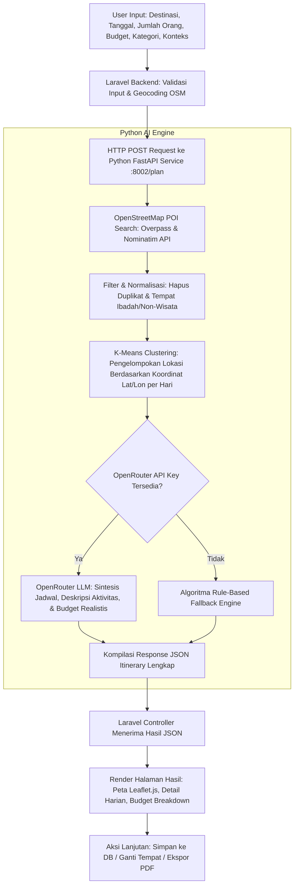

# 🌴 TripMate AI Travel Planner

> **Smart AI-Powered Travel Itinerary Generator with Geospatial Clustering & OpenStreetMap Integration**

TripMate AI Travel Planner adalah aplikasi pembuat rencana perjalanan (itinerary) pintar yang menggabungkan kekuatan **Laravel (PHP)** sebagai web backend yang responsif dan **FastAPI (Python)** sebagai mesin komputasi AI & *Geospatial Machine Learning*.

---

## 📌 Table of Contents
- [About This Project](#-about-this-project)
- [Features](#-features)
- [Alur Logika](#-alur-logika)
- [Project Structure](#-project-structure)
- [Running Locally](#-running-locally)
- [License](#-license)

---

## 📖 About This Project

Merencanakan liburan sering kali memakan waktu, mulai dari mencari destinasi wisata yang relevan, mengatur rute agar tidak bolak-balik, hingga menghitung estimasi anggaran biaya rombongan secara realistis. 

**TripMate AI Travel Planner** hadir untuk menyelesaikan permasalahan tersebut dengan mengombinasikan:
1. **Pencarian Data Nyata (Real-World Geospatial Data)**: Menggunakan OpenStreetMap (Nominatim & Overpass API) untuk menemukan tempat wisata, kuliner, alam, budaya, dan hiburan yang terverifikasi di wilayah Indonesia.
2. **Geographic Clustering (K-Means Algorithm)**: Mengelompokkan destinasi harian berdasarkan kedekatan koordinat geografis (*latitude* & *longitude*) agar rute perjalanan efisien dan hemat waktu.
3. **OpenRouter LLM Intelligence**: Memanfaatkan LLM untuk menyusun alur cerita rencana perjalanan, rekomendasi aktivitas kontekstual, serta perhitungan budget realistis sesuai jumlah orang dan hari.
4. **Interactive & User-Friendly Interface**: Dibangun dengan Laravel Blade modern, peta interaktif Leaflet.js, fitur simpan rencana, ganti destinasi secara instan (*item regenerate*), dan ekspor ke format cetak / PDF.

---

## ✨ Features

- 📍 **Cascading Wilayah Indonesia**: Pemilihan provinsi dan kabupaten/kota secara dinamis terintegrasi dengan API Wilayah Indonesia.
- 🎯 **Multi-Category Preference**: Pilihan kategori wisata fleksibel (*Pantai, Kuliner, Alam, Budaya, Hiburan*).
- 🧭 **Geographic Clustering (K-Means)**: Pembagian jadwal harian berbasis kedekatan jarak fisik destinasi wisata.
- 🤖 **OpenRouter LLM Integration**: Generasi itinerary cerdas dengan dukungan model canggih via OpenRouter (dengan *fallback engine* cerdas jika API offline).
- 🔄 **Regenerate Single Item (Ganti Tempat)**: Menukar satu destinasi wisata tertentu dengan destinasi alternatif secara langsung tanpa mengulang seluruh itinerary.
- 💰 **Budget Breakdown & Analysis**: Estimasi rincian biaya (transportasi, penginapan, kuliner, tiket masuk) dengan indikator status anggaran (*Cukup / Melebihi Budget*).
- 🗺️ **Peta Interaktif (Leaflet.js)**: Visualisasi marker destinasi harian lengkap dengan nomor urut hari dan koordinat presisi.
- 💾 **Database Trip Management**: Fitur simpan rencana perjalanan, riwayat itinerary (*history*), dan hapus rencana.
- 📄 **Cetak & Export PDF**: Tampilan ramah cetak untuk mengunduh itinerary dalam format PDF siap pakai.

---

## 🧠 Alur Logika

Berikut adalah arsitektur dan diagram alur pemrosesan dari input pengguna hingga terbentuk itinerary akhir:



### Penjelasan Tahapan Alur:
1. **Input & Validasi (Laravel)**: Pengguna mengisi formulir parameter perjalanan. Laravel memvalidasi data dan mencari titik pusat koordinat kota melalui OpenStreetMap.
2. **Komunikasi Microservice**: Laravel mengirimkan payload parameter ke service Python FastAPI melalui endpoint `/plan`.
3. **Pencarian Geospatial (Python)**: Mesin Python menanyakan titik-titik POI (*Point of Interest*) nyata pada OpenStreetMap yang berada dalam *bounding box* destinasi.
4. **Pembersihan & Filtering**: Sistem menyaring entitas non-wisata (seperti tempat ibadah, fasilitas umum non-wisata) serta menghapus entri duplikat.
5. **Klasterisasi Geografis (Scikit-Learn K-Means)**: Koordinat tempat wisata dikelompokkan ke dalam sejumlah klaster sesuai jumlah hari liburan, memastikan tempat-tempat dalam satu hari berada di area yang berdekatan.
6. **Sintesis AI (OpenRouter LLM / Fallback)**: AI merangkai jadwal, menyusun deskripsi tips lokal, menghitung biaya per orang vs rombongan, serta memverifikasi ketersediaan kategori.
7. **Penyajian Data & Interaktivitas**: Laravel menampilkan hasil secara visual, menyediakan opsi ganti lokasi alternatif per tempat (`/travel/regenerate-item`), penyimpanan ke database (`/trips/save`), dan export PDF (`/trips/{id}/pdf`).

---

## 📁 Project Structure

```text
travelplanner_2/
├── app/
│   ├── Http/
│   │   └── Controllers/
│   │       └── TravelPlannerController.php   # Controller utama alur trip & integrasi API
│   ├── Models/
│   │   └── Trip.php                          # Model Eloquent untuk data trip tersimpan
│   └── Services/
│       └── OpenStreetMapService.php          # Service pencarian koordinat & geocoding OSM
├── bootstrap/                                # Bootstrap file Laravel
├── config/                                   # Konfigurasi sistem Laravel
├── database/
│   └── migrations/
│       └── 2026_09_21_000001_create_trips_table.php # Migrasi tabel trips
├── public/                                   # File publik & aset web
├── python/                                   # Python AI & Geospatial Engine
│   ├── .env                                  # Environment variable Python (API Key)
│   ├── main.py                               # FastAPI App, K-Means Clustering, LLM Handler
│   └── requirements.txt                      # Dependensi Python
├── resources/
│   └── views/
│       └── travel/
│           ├── history.blade.php             # Halaman riwayat itinerary tersimpan
│           ├── index.blade.php               # Halaman form input parameter perjalanan
│           ├── pdf.blade.php                 # Template cetak PDF
│           └── result.blade.php              # Halaman visualisasi hasil & peta interaktif
├── routes/
│   ├── console.php
│   └── web.php                               # Definisi rute web aplikasi
├── .env.example                              # Contoh variabel environment Laravel
├── composer.json                             # Dependensi PHP / Laravel
├── package.json                              # Dependensi Frontend
└── README.md                                 # Dokumentasi proyek
```

---

## 🚀 Running Locally

Ikuti langkah-langkah di bawah ini untuk menjalankan proyek di komputer lokal:

### 1. Prasyarat Sistem
- **PHP** >= 8.2 (dengan ekstensi `pdo_sqlite` / `pdo_mysql`, `curl`, `mbstring`, `fileinfo`)
- **Composer**
- **Python** >= 3.10 & **pip**
- **Node.js & npm** (opsional untuk asset compiling)
- Web server lokal seperti **Laragon**, **XAMPP**, atau PHP Built-in Server

---

### 2. Setup Backend Laravel

Buka terminal dan arahkan ke direktori root proyek:

```bash
# 1. Install dependensi PHP
composer install

# 2. Salin file environment
cp .env.example .env

# 3. Generate Application Key
php artisan key:generate

# 4. Jalankan migrasi database (SQLite / MySQL)
php artisan migrate

# 5. Jalankan server Laravel (default port 8000)
php artisan serve
```
> Server Laravel akan aktif di `http://127.0.0.1:8000`.

---

### 3. Setup Python AI Engine

Buka jendela terminal baru, lalu masuk ke direktori `python/`:

```bash
# 1. Masuk ke folder python
cd python

# 2. Buat dan aktifkan virtual environment (opsional tetapi disarankan)
# Windows (PowerShell):
python -m venv venv
.\venv\Scripts\activate
# Linux / macOS:
# source venv/bin/activate

# 3. Install seluruh dependensi Python
pip install -r requirements.txt

# 4. Konfigurasi Environment Variable
# Buat atau edit file .env di dalam folder python/ (atau di root project)
# Tambahkan API Key OpenRouter Anda (opsional jika ingin menggunakan LLM online):
# OPENROUTER_API_KEY=sk-or-v1-xxxxxxxxxxxxxxxxxxxx
# OPENROUTER_MODEL=deepseek/deepseek-v4-flash-0731:free

# 5. Jalankan microservice FastAPI
python main.py
```
> Mesin FastAPI akan aktif di `http://127.0.0.1:8002`.

---

### 4. Buka Aplikasi

Setelah kedua service (**Laravel** di port `8000` dan **FastAPI** di port `8002`) berjalan:
1. Buka browser dan akses: `http://127.0.0.1:8000`
2. Pilih provinsi dan kabupaten/kota tujuan.
3. Tentukan rentang tanggal, jumlah orang, anggaran, serta kategori wisata yang disukai.
4. Klik **Generate Rencana Perjalanan** untuk melihat hasil rekomendasi cerdas.

---

## 📄 License

Proyek ini dilisensikan di bawah lisensi [MIT License](LICENSE).
Silakan gunakan, kembangkan, dan modifikasi untuk keperluan edukasi maupun pengembangan lebih lanjut.
